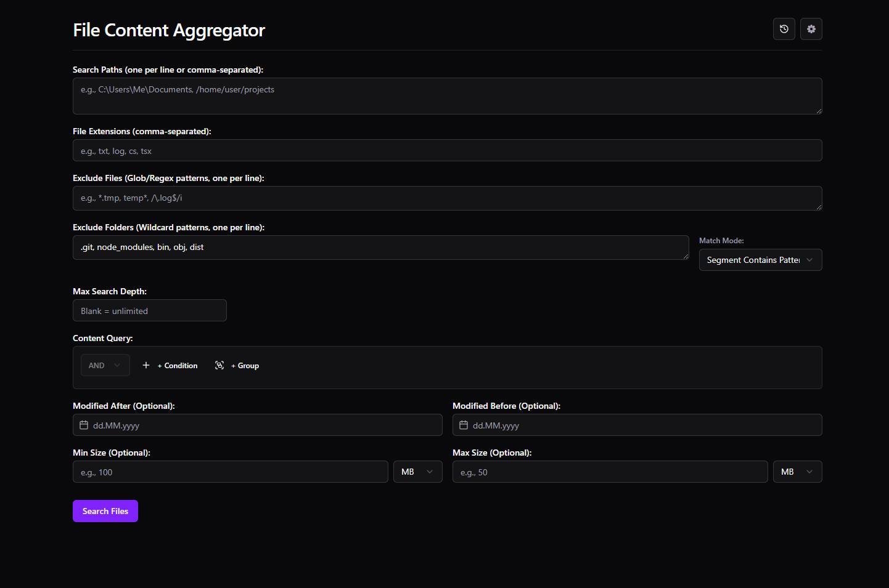

# File Content Aggregator



A cross-platform desktop application built with Electron and React to efficiently search for files based on name, path, metadata, and content across multiple directories, featuring a powerful boolean and proximity query engine.

## Key Features

- **Multi-Directory Search:** Specify multiple starting paths for your search.
- **Flexible Filtering:**
  - Filter by **file extensions** (e.g., `.txt`, `.log`, `.ts`).
  - Exclude specific **files** using glob patterns or regular expressions (e.g., `*.tmp`, `/temp\d+\.log/i`).
  - Exclude specific **folders** using wildcard patterns with different matching modes (Contains, Exact, Starts With, Ends With - e.g., `node_modules`, `.git*`, `*cache*`).
  - Filter by **modification date** range (Modified After / Before).
  - Filter by **file size** range (Min / Max Size).
  - Limit **search depth** within directories.
- **Advanced Content Querying:**
  - **Structured Query Builder:** Easily build complex content searches visually.
  - **Simple Term:** Find exact text matches (case-sensitive option available).
  - **Regular Expressions:** Use `/pattern/flags` for powerful pattern matching within file content.
  - **Boolean Logic:** Combine terms and expressions using `AND`, `OR`, `NOT`, and parentheses `()`.
  - **Proximity Search:** Find terms near each other using `NEAR(term1, term2, distance)` (e.g., `NEAR(error, database, 5)` finds "error" within 5 words of "database").
- **Efficient Results Display:**
  - **Text Block View:** Shows concatenated content of matching files.
  - **Tree View:** Lists all processed files, showing content previews for matches or error messages for non-matches/read errors.
  - **Virtualization:** Uses `react-window` and `react-virtualized-auto-sizer` to handle potentially huge numbers of files and large result sets smoothly.
  - **Syntax Highlighting:** Highlights code snippets in the tree view using `highlight.js` in a web worker for performance.
  - **Results Filtering:** Filter the displayed results (both text and tree views) on the fly.
  - **Copy & Export:** Copy individual file content or all results (text block view) to the clipboard. Export all processed results (tree view data) to **CSV**, **JSON**, or **Markdown** files.
- **Application Features:**
  - **Search History:** Automatically saves searches; view, load, filter, name, favorite, and delete past searches.
  - **Internationalization (i18n):** Supports multiple languages (Currently: English, German, Spanish, French, Italian, Japanese, Portuguese, Russian). Uses `i18next`.
  - **Theming:** Supports Light, Dark, and System Default themes using Tailwind CSS and `shadcn/ui`.
  - **Progress & Cancellation:** Real-time progress bar during search with the ability to cancel ongoing searches.
- **Security Focused:**
  - Built with Electron's security best practices in mind (Context Isolation, Sandbox enabled).
  - Strict Content Security Policy (CSP).
  - IPC message validation.

## Installation

Pre-built binaries for Windows, macOS, and Linux can be found on the [**GitHub Releases**](https://github.com/12Mosch/File-Content-Aggregator/releases) page.

- **Windows:** Download the `.exe` (portable) or `.msi` (installer).
- **macOS:** Download the `.dmg` file. Open it and drag the application to your Applications folder.
- **Linux:** Download the `.AppImage` file. Make it executable (`chmod +x file-content-aggregator*.AppImage`) and run it.

## Usage

1.  Launch the application.
2.  **Configure Search:**
    - Enter the **Search Paths** (one per line or comma-separated).
    - Specify required **File Extensions**.
    - Add any **Exclude Files/Folders** patterns.
    - Use the **Content Query** builder or leave blank to search based only on metadata/filters.
    - Set optional filters like **Max Depth**, **Date Modified**, and **File Size**.
    - _(Note: Date input supports `DD.MM.YYYY` format via keyboard)_.
3.  Click **Search Files**.
4.  View progress and results. Use the **Cancel Search** button if needed.
5.  Switch between **Text Block** and **Tree View** using the radio buttons.
6.  Use the **Filter Results** input to narrow down the displayed results.
7.  Use the **Copy to Clipboard** button (for Text Block view) or the **Export Format** dropdown and **Save Results As...** button (exports all processed files' data) below the results. Use the copy icon in the Tree View header to copy individual file content.
8.  Access **Settings** (⚙️) or **Search History** (🕒) using the buttons in the header.

## Development

To run the application locally for development:

1.  **Clone the repository:**
    ```bash
    git clone <https://github.com/12Mosch/File-Content-Aggregator>
    cd file-content-aggregator
    ```
2.  **Install dependencies:**
    ```bash
    npm install
    ```
3.  **Run the development server:**
    ```bash
    npm run dev
    ```
    This will start the Vite development server for the React UI and launch the Electron application connected to it, usually with developer tools open.

## Building

To build the application for distribution:

- Build for all platforms: `npm run dist`
- Build for Windows (x64): `npm run dist:win`
- Build for macOS (arm64): `npm run dist:mac`
- Build for Linux (x64): `npm run dist:linux`

The distributable files will be located in the `release/` directory.

## Technology Stack

- **Framework:** Electron
- **UI Library:** React 19
- **Bundler/Dev Server:** Vite
- **Language:** TypeScript
- **Styling:** Tailwind CSS
- **UI Components:** shadcn/ui
- **Internationalization:** i18next, react-i18next
- **Virtualization:** react-window, react-virtualized-auto-sizer
- **File Searching:** fast-glob, picomatch
- **Content Query Parsing:** jsep
- **Syntax Highlighting:** highlight.js
- **Date Handling:** date-fns
- **Concurrency Limiting:** p-limit
- **Persistent Storage:** electron-store

## Documentation

- **User Guide:** Detailed instructions and feature explanations can be found in [`/docs/user-guide.md`](./docs/user-guide.md).
- **Developer Guide:** Information on project structure, architecture, and development processes is in [`/docs/developer-guide.md`](./docs/developer-guide.md).
- **Code Documentation:** Key functions and modules include TSDoc comments.

## Contributing

Contributions are welcome! Please read the [**CONTRIBUTING.md**](./CONTRIBUTING.md) file for guidelines on how to contribute to this project.
