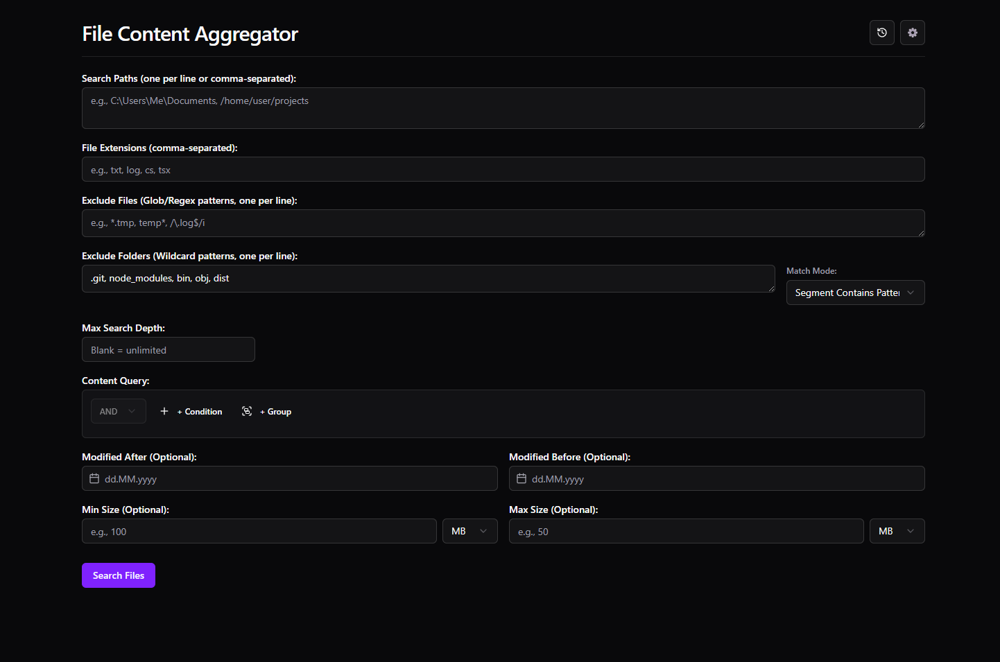

# File Content Aggregator - User Guide

Welcome to the File Content Aggregator! This guide will help you install, configure, and effectively use the application to find the information you need within your files.

## Table of Contents

- [Installation](#installation)
- [Getting Started: Interface Overview](#getting-started-interface-overview)
- [Searching for Files](#searching-for-files)
  - [Search Form Fields](#search-form-fields)
  - [Content Query Builder](#content-query-builder)
  - [Running and Cancelling Searches](#running-and-cancelling-searches)
- [Understanding Results](#understanding-results)
  - [Results Summary](#results-summary)
  - [Results View (Tree View)](#results-view-tree-view)
  - [Filtering Results (Fuzzy Search)](#filtering-results-fuzzy-search)
  - [Sorting Results](#sorting-results)
  - [Copying and Exporting Results](#copying-and-exporting-results)
    - [Selecting Files for Export](#selecting-files-for-export)
- [Search History](#search-history)
- [Settings](#settings)
- [Troubleshooting](#troubleshooting)
- [Feedback and Support](#feedback-and-support)

## Installation

Download the latest version for your operating system from the [**GitHub Releases**](https://github.com/12Mosch/File-Content-Aggregator/releases) page.

- **Windows:**
  - **Installer:** Download the `.msi` file and run it.
  - **Portable:** Download the `.exe` file and run it directly. No installation is needed.
- **macOS:**
  - Download the `.dmg` file.
  - Open the `.dmg` file.
  - Drag the "File Content Aggregator" application icon into your "Applications" folder.
  - Launch it from the Applications folder.
- **Linux:**
  - Download the `.AppImage` file.
  - Make the file executable: Open a terminal in the download directory and run `chmod +x file-content-aggregator*.AppImage`.
  - Run the application: `./file-content-aggregator*.AppImage`.

## Getting Started: Interface Overview

When you launch the application, you'll see the main window:

 <!-- Updated path -->

1.  **Header:** Contains the application title and buttons to access Search History (🕒) and Settings (⚙️).
2.  **Search Form:** This is where you define all your search criteria.
3.  **Results Area:** Displays the progress bar during a search and the search results afterwards.

## Searching for Files

The core of the application is the Search Form. Fill in the relevant fields to define what and where you want to search.

### Search Form Fields

- **Search Paths:**
  - Enter the full paths to the directories you want to search in.
  - You can enter multiple paths, separated by a **new line** or a **comma**.
  - _Example:_
    ```
    C:\Users\Me\Documents
    D:\Projects\ProjectA\src, D:\Logs
    /home/user/code
    ```
- **File Extensions:**
  - Specify the file types to include in the search.
  - Enter extensions **without the leading dot**, separated by commas.
  - _Example:_ `txt, log, ts, cs, json, md`
- **Exclude Files (Glob/Regex):**
  - Specify patterns for filenames to _exclude_ from the search. Enter one pattern per line.
  - Supports **glob patterns** (like `*.tmp`, `temp*`, `?cache`) and **regular expressions** (enclosed in slashes, e.g., `/\.(bak|old)$/i`).
  - _Example:_
    ```
    *.tmp
    package-lock.json
    /^\._/  # Exclude macOS metadata files
    ```
- **Exclude Folders (Wildcards):**
  - Specify patterns for folder names to _exclude_ entire directories and their contents. Enter one pattern per line.
  - Uses wildcard matching (`*` matches any sequence of characters, `?` matches a single character).
  - **Match Mode:** Select how the pattern should match folder names within the path:
    - `Segment Contains Pattern`: Excludes if _any part_ of a folder name matches (e.g., `cache` excludes `__pycache__`, `.cache`).
    - `Segment Exactly Matches Pattern`: Excludes only if the folder name is an exact match (e.g., `node_modules`).
    - `Segment Starts With Pattern`: Excludes if a folder name starts with the pattern (e.g., `.git` excludes `.git`, `.github`).
    - `Segment Ends With Pattern`: Excludes if a folder name ends with the pattern (e.g., `_backup`).
  - _Example (using 'Contains' mode):_
    ```
    node_modules
    .git
    bin
    obj
    dist
    *cache*
    ```
- **Max Search Depth:**
  - Optionally limit how many levels deep the search should go within subdirectories.
  - Leave blank for unlimited depth. Enter `1` to search only the top-level directory, `2` for the top level and its immediate subdirectories, etc.
- **Content Query:**
  - Use the **Query Builder** (see next section) to define criteria for searching _inside_ file content. Leave this empty if you only want to search by filename/path/metadata.
  - **Search Mode:** Select how the content query should be interpreted:
    - `Boolean Query`: (Default) Uses the Query Builder to create complex logical expressions with AND/OR operators.
    - `Simple Term`: Searches for exact text matches without Boolean logic.
    - `Regular Expression`: Interprets the query as a regular expression pattern.
    - `Fuzzy Search`: Uses approximate matching to find content similar to the query term, tolerating typos and variations.
- **Modified After / Before:**
  - Optionally filter files based on their last modification date.
  - Click the input field or the calendar icon (🗓️) to open the date picker.
  - You can navigate months/years using the arrows (`<`, `>`) or double arrows (`<<`, `>>`). Click the Month or Year in the header to select from a list.
  - You can also type the date directly into the input field using `DD.MM.YYYY` format (e.g., `31.12.2023`). Press Enter to confirm the typed date.
  - Click the `X` button to clear a selected date.
- **Min Size / Max Size:**
  - Optionally filter files based on their size.
  - Enter a numeric value and select the unit (Bytes, KB, MB, GB).

### Content Query Builder

This powerful tool lets you define complex search criteria for the _content_ of the files. If you add any conditions here, only files matching _both_ the form filters (path, extension, date, etc.) _and_ the content query will be included in the results preview.

The **Search Mode** dropdown next to the Query Builder lets you choose how your query is interpreted:

- **Boolean Query:** (Default) Uses the Query Builder to create complex logical expressions with AND/OR operators as described below. Also supports fuzzy matching for terms that don't match exactly, including within the NEAR function.
- **Simple Term:** Searches for exact text matches without Boolean logic. Use this for simple searches where you just want to find files containing specific text.
- **Regular Expression:** Interprets the query as a regular expression pattern. Useful for advanced pattern matching.

- **Adding Conditions/Groups:**
  - Click `+ Condition` to add a new search term/rule.
  - Click `+ Group` to add a nested group, allowing you to create more complex logic (e.g., `(TermA AND TermB) OR TermC`).
- **Operators (AND/OR):**
  - Each group has an operator (`AND` or `OR`) that defines how its direct children (conditions or subgroups) are combined.
  - `AND`: _All_ conditions/subgroups within the group must be true.
  - `OR`: _At least one_ condition/subgroup within the group must be true.
- **Condition Types:**
  - **Term:** Finds simple text.
    - Enter the text directly (e.g., `database connection`).
    - Use quotes (`"`) if your text includes spaces or keywords like `AND`, `OR`, `NOT`, `NEAR` (e.g., `"user OR admin"`).
    - Quoted terms like `"database"` will be automatically highlighted without the quotes in the search results.
    - When using multiple search terms, all terms will be highlighted in violet in the content previews, making it easy to locate relevant parts of matched files.
    - The **Case-Sensitive** checkbox _below_ the builder applies _only_ to these simple `Term` conditions.
  - **Regex:** Finds text matching a regular expression pattern.
    - Enter the pattern between slashes (`/pattern/flags`).
    - _Example:_ `/error\d+/i` finds "error" followed by one or more digits, ignoring case.
    - Common flags: `i` (ignore case), `g` (global - usually implicit in search).
  - **NEAR:** Finds two terms within a specified word distance of each other.
    - Syntax: `NEAR(term1, term2, distance)`
    - `term1`, `term2`: Can be simple text (quoted if needed) or a `/regex/`.
    - `distance`: The maximum number of words allowed between the end of the first term and the start of the second term.
    - _Example:_ `NEAR("user login", /fail(ed|ure)/i, 10)` finds "user login" within 10 words of "failed" or "failure" (case-insensitive).
    - Supports fuzzy matching for non-regex terms, so it can find approximate matches when exact matches aren't found.
- **Removing Items:** Click the trash icon (🗑️) next to any condition or group to remove it.

### Running and Cancelling Searches

- **Start:** Once your criteria are set, click the **Search Files** button.
- **Progress:** A progress bar will appear, showing the number of files processed and the current status.
- **Cancel:** While the search is running (`Searching...` button state), a **Cancel Search** button will appear next to it. Click this to request the search to stop early. The progress bar will indicate cancellation, and the results shown will be up to the point of cancellation.

## Understanding Results

After a search completes (or is cancelled), the results area will update.

### Results Summary

Above the results display, you'll see a summary:

- **Files Found (Initial):** The total number of files matching your path and extension filters _before_ content/metadata filtering.
- **Files Processed:** The number of files whose content or metadata was actually checked against your criteria.
- **File Read Errors:** The number of files that couldn't be read due to permissions or other issues (details shown in the error section below the form if any occurred).
- **Total Files:** The count of items currently displayed in the results view (changes based on filtering and sorting).

### Results View

The results are displayed in a Tree View:

- Lists _all_ files that were processed (passed initial path/extension/metadata filters).
- Click the arrow (`▶`/`▼`) or the file path to expand/collapse an item and view its content preview (if available).
- **Matched Files:** Show a preview of their content (syntax highlighted where possible). **The specific search terms from your Content Query that caused the match will be highlighted in violet** within the preview, making it easy to locate relevant parts of matched files. When using multiple search terms, all terms will be highlighted. Content is loaded on demand when you expand the item. If content is long, a "Show More" button appears.
- **Non-Matching Files:** Show only the file path (content preview is hidden).
- **Files with Read Errors:** Show the file path and the specific error (e.g., "Permission Denied").
- **File Actions and Selection:** Each file in the results has a checkbox for selection and action buttons in its header:
  - **Checkbox:** Click to select or deselect the file for export. Selected files can be exported using the "Export Selected" button at the bottom of the results area.
  - **Copy Icon (📄):** Click to copy _only that file's_ full content to the clipboard (only enabled once content is loaded).
  - **Open File Icon (↗️):** Click to open the file with the default system application associated with its file type.
  - **Show in Folder Icon (📂):** Click to open the file's containing folder in the system's file explorer, with the file selected.

### Filtering Results (Fuzzy Search)

- Use the **Fuzzy Filter Results** input box above the results display to quickly filter the _currently displayed_ results in the Tree View.
- This filter uses **fuzzy matching**, meaning it will find approximate matches, not just exact ones. For example, filtering for "config" might also show files like "configuration" or "cnfig".
- The filter searches within the **File Path** and any **Read Error** messages displayed in the list. The file path itself will be highlighted based on the fuzzy filter term.
- Check the **Case-Sensitive** box next to it to make the fuzzy filter match case.
- This filter operates _only_ on the results already found by the main search; it doesn't perform a new file system search.

### Sorting Results

- Use the **Sort By** dropdown to select the criteria for sorting the results list:
  - **File Path:** Sorts alphabetically by the full file path.
  - **File Size:** Sorts numerically by the file size (requires file system access, may be slightly slower initially).
  - **Date Modified:** Sorts chronologically by the file's last modification date (requires file system access).
  - **Match Status:** Groups files based on whether they matched the content query (if provided).
- Use the **Direction** dropdown to choose between **Ascending** (A-Z, smallest/oldest first, non-matched first) or **Descending** (Z-A, largest/newest first, matched first).
- Sorting applies to the currently displayed (and potentially filtered) results.

### Copying and Exporting Results

Below the results display area, you'll find options to copy or save the results:

- **Format:** Select the desired format for copying or exporting the results:
  - **TXT:** Creates a simple text file listing file paths, statuses, and content/errors.
  - **CSV:** Creates a Comma Separated Value file with columns for FilePath, Status (Matched, Read Error, Not Matched), and Details (content or error message). Suitable for spreadsheets.
  - **JSON:** Creates a JSON file containing an array of all processed files, including their path, status, and content/error details. Suitable for programmatic use.
  - **Markdown:** Creates a Markdown file with each file listed under a heading, followed by its status and content/error message in a code block. Suitable for documentation or readable reports.
- **Copy Results:** Copies the data for _all processed files_ (including content for matched files, formatted according to the selected **Format**) to your clipboard. The copied data respects the current **sort order** and **filter**.
  - ⚠️ **Warning:** If the result set is very large, the generated text might be truncated by your operating system's clipboard limits. Use the "Save Results As..." option instead for large result sets.
- **Save Results As...:** Opens a system dialog allowing you to save the data for _all processed files_ (including content for matched files) to a file in the selected **Format**. The saved data respects the current **sort order** and **filter**. This is the recommended way to export large or structured results.
- **Selecting Files for Export:**
  - Each file in the results list has a checkbox at the beginning of its row that allows you to select or deselect it.
  - Use the **Select All** button to select all files currently displayed in the results list.
  - Use the **Deselect All** button to clear all selections.
  - The number of currently selected files is displayed next to these buttons.
- **Export Selected:** Allows you to export only the files you've selected (via checkboxes) to a file in the selected **Format**. This is useful when you only want to export a subset of the search results.

## Search History

Click the history icon (🕒) in the header to open the Search History modal.

- **View:** See a list of your past searches, sorted by time (most recent first) and favorites. Searches with the exact same parameters will update the timestamp of the existing entry rather than creating duplicates.
- **Load:** Click the "Load" button on an entry to repopulate the Search Form with that search's parameters.
- **Filter:** Use the filter input at the top of the modal to quickly find past searches by name, path, query terms, etc.
- **Name/Favorite:**
  - Click the star (⭐) to toggle an entry as a favorite (favorites appear at the top).
  - Click the displayed name (or "Untitled Search") to edit and give the search a memorable name. Press Enter or click the checkmark (✓) to save, or Escape/X to cancel editing.
- **Delete:** Click the trash icon (🗑️) to remove a single entry.
- **Clear All:** Click the "Clear All History" button (requires confirmation) to permanently delete all saved searches.

## Settings

Click the settings icon (⚙️) in the header to open the Application Settings modal.

- **Interface Language:** Choose your preferred language for the application's interface.
- **Theme:** Select your preferred visual theme:
  - `Light`: Light background, dark text.
  - `Dark`: Dark background, light text.
  - `System Default`: Automatically matches your operating system's light/dark mode setting.
- **Default Export Format:** Choose the format (TXT, CSV, JSON, MD) that will be selected by default when copying or exporting results. TXT is the initial default.
- **Fuzzy Search Settings:**
  - **Enable Fuzzy Search in Boolean Queries:** When enabled (default), automatically applies fuzzy matching to terms in Boolean queries when exact matches aren't found. Disable this option if you want only exact matches in Boolean queries.
  - **Enable Fuzzy Search in NEAR Function:** When enabled (default), allows the NEAR function to find approximate matches for terms that don't match exactly. Disable this option if you want the NEAR function to only find exact matches.

## Troubleshooting

- **No Results Found:**
  - Double-check your **Search Paths** are correct and accessible.
  - Verify your **File Extensions** are correct (no dots, comma-separated).
  - Make sure your **Exclude** patterns aren't accidentally excluding the files you want.
  - Simplify your **Content Query** or remove it temporarily to see if files are found based on path/extension alone. Check query syntax carefully (quotes, slashes for regex, NEAR format).
  - Ensure **Date** and **Size** filters aren't too restrictive.
- **Permission Denied Errors:** The application needs read access to the directories and files you are searching. If searching system-protected areas, you might need to adjust folder permissions (consult your OS documentation). Avoid running the application with elevated privileges (like `sudo` or "Run as Administrator") unless absolutely necessary and you understand the security implications. The application attempts to filter out permission errors for folders you've explicitly excluded.
- **Search is Very Slow:**
  - Searching large directories (like `C:\` or `/`) or directories with millions of files will take time.
  - Complex regular expressions in the content query can be slow.
  - Searching very deep directory structures can be slow; try using **Max Depth**.
  - Use **Exclude Folders** effectively (e.g., `node_modules`, build output folders, backup folders).
- **UI Glitches / Freezes:** Try restarting the application. If the problem persists, report it.
- **Export Fails:** Ensure you have write permissions for the location where you are trying to save the file. Check for error messages displayed by the application.
- **Copy Fails / Seems Incomplete:** The total size of the formatted results might exceed your system's clipboard limit. Use the "Save Results As..." option instead for large result sets.
- **Content Not Loading in Tree View:** Check for "File Read Errors" displayed below the search form. The application might lack permission to read the specific file.
- **Sorting by Size/Date is Slow:** Fetching metadata for sorting requires accessing each file's information, which can take time for very large result sets.
- **Fuzzy Filter Not Working as Expected:**
  - Ensure you've typed at least 2 characters in the filter box.
  - The fuzzy match might be less precise than expected. Try refining your filter term.
  - Remember it only filters the file path and error messages shown in the list, not the file content itself.
- **Fuzzy Matching in Boolean Query Not Working as Expected:**
  - Fuzzy matching is automatically applied when an exact match isn't found for terms of 3 or more characters.
  - Fuzzy search is designed to find approximate matches, so it may return more results than expected.
  - Fuzzy matching also works within the NEAR function, helping find terms that are approximately similar.
  - If you need more precise matching, use exact quoted terms or regular expressions, or disable fuzzy search in the Settings.
- **Search Term Highlighting Not Working:**
  - Highlighting only applies to the content preview of files that _matched_ the Content Query.
  - Search terms are highlighted in both plain text and syntax-highlighted code previews, making it easy to locate the relevant parts of matched files.
  - Multiple search terms in the Content Query are all highlighted in violet, making it easy to spot all matches.
  - Quoted terms like `"database"` are automatically highlighted without the quotes.
  - Boolean operators (AND, OR) are not highlighted, only the actual search terms.
  - Hover over highlighted terms to see more information about the highlighting feature.

## Feedback and Support

If you encounter bugs, have suggestions for improvements, or need further assistance, please open an issue on the project's [**GitHub Issues**](https://github.com/12Mosch/File-Content-Aggregator/issues) page.
